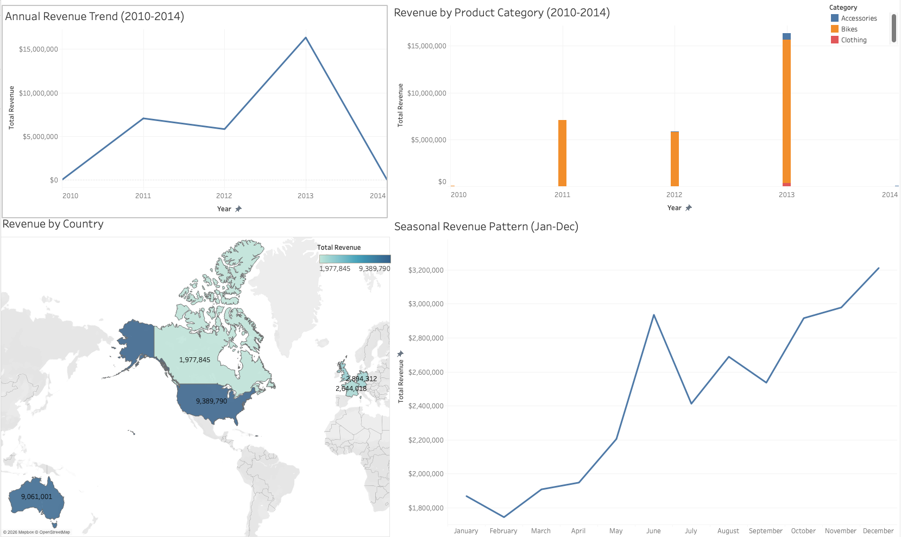

# AdventureWorks Sales Performance Analysis
### SQL Business Intelligence Project | AdventureWorksDW2022

**Author:** Tunay Arman Gürbüz
**Tools:** SQL Server · VS Code · Tableau Public · AdventureWorksDW2022
**Status:** Completed — 26 March 2026

---

## Project Overview

This project is a structured end-to-end SQL business intelligence analysis of internet sales performance for a global cycling company, covering the period **December 2010 to January 2014**.

The analysis follows a systematic technique progression — from database exploration through to advanced segmentation and original strategic analysis — to surface actionable business insights from a Microsoft SQL Server data warehouse.

The dataset used is **AdventureWorksDW2022**, a Microsoft sample data warehouse structured as a star schema with `FactInternetSales` as the primary fact table, joined to dimension tables for products, customers, geography, and time.

> All sales amounts are reported in USD. Currency conversion was applied at source during the ETL process and is reflected in the SalesAmount column.

---

## Business Objectives

This analysis was designed to answer five core strategic questions:

1. How has revenue and profitability trended year-on-year?
2. Which product categories and subcategories drive growth?
3. Which geographic markets generate the highest revenue — and the highest-value customers?
4. Are there products losing momentum that signal a portfolio strategy shift?
5. Does this business show seasonal patterns that should inform commercial planning?

---

## Key Findings

### 1. Overall Business Performance
- The business generated **$29.4M in total revenue** and **$12.1M gross profit** across the analysis period
- Gross margin was remarkably consistent at **~41% across all years** — indicating strong pricing discipline regardless of product mix shifts
- Average order value of **$486** reflects a blend of high-value bike purchases and lower-value accessories

### 2. The 2013 Inflection Point
- Revenue surged from **$5.8M in 2012 to $16.4M in 2013** — a 180% increase
- This was not organic growth. It was the result of a deliberate **product portfolio expansion**: the company launched the Touring Bike line and simultaneously expanded into Accessories and Clothing
- Orders grew 6.5x and units sold grew 15.5x — driven by high-volume, low-value accessory items entering the portfolio for the first time

### 3. Category Concentration Risk
- **Bikes account for 96% of total revenue** ($28.3M of $29.4M)
- Accessories generated only $700K despite having the highest order volume (18,208 orders)
- The business remains heavily dependent on a single category — a strategic vulnerability

### 4. Geographic Market Insights
| Country |         Total Revenue | Total Customers | Avg Revenue Per Customer |
|---------|--------------------------|-----------------|--------------------------|
| United States |       $9.4M |          7,819 |                 $1,201 |
| Australia |           $9.1M |          3,591 |             **$2,523** |
| United Kingdom |      $3.4M |          1,913 |                 $1,773 |
| Germany |             $2.9M |          1,780 |                 $1,626 |
| France |              $2.6M |          1,810 |                 $1,461 |
| Canada |              $2.0M |          1,571 |                 $1,259 |

**Key insight:** Australia matches the US in total revenue but with less than half the customers — meaning Australian customers spend more than twice as much per person. The US leads on volume; Australia leads on value.

### 5. Product Portfolio Refresh
- Analysis identified **37 products that sold in 2011 but recorded zero sales in 2013**
- These are entirely the **Mountain-100** and **Road-150 Red** lines — the flagship premium models of the early period
- These were not declining — they were **deliberately retired** and replaced by the Mountain-200, Mountain-400, Mountain-500, Road-250, Road-350, and Road-750 lines
- This represents a full product generation transition executed between 2011 and 2013

### 6. Seasonal Patterns
- **June** consistently shows the highest average order value ($526) — spring/summer cycling season driving premium purchases
- **October–December** are the strongest revenue months, generating a combined **$9.1M** vs **$5.7M** for January–May — a gap of $3.4M that represents a clear opportunity for targeted off-peak promotion
- December alone averages $514 per order, suggesting strong year-end and gifting behaviour

---

## Strategic Recommendations

**1. Reduce category concentration risk**
With Bikes at 96% of revenue, any disruption to the bike market — supply chain, competition, or demand shift — poses existential risk to the business. The 2013 expansion into Accessories and Clothing was the right strategic move, but these categories need to grow from 4% to a meaningful share of revenue.

**2. Invest in the Australian market**
Australia has fewer customers than the US but generates nearly identical revenue — because its customers spend more than double per person. Increasing customer acquisition in Australia (through targeted marketing or channel expansion) would generate disproportionate revenue returns compared to equivalent investment in the US market.

**3. Address Canada's underperformance**
Canada has the lowest average order value ($586) and the weakest revenue per customer ($1,259) despite having a comparable customer base size to other European markets. This warrants investigation — is the product mix different? Are customers buying only accessories? Is pricing or distribution the issue?

**4. Build a seasonal commercial strategy**
The January–May period consistently underperforms October–December by $3.4M. A deliberate promotional strategy tied to the seasonal calendar — spring launch campaigns in April/May to capture the June peak, and Q4 gifting campaigns from October — could materially smooth revenue across the year.

**5. Monitor the new product lines for retention**
The Mountain-100 and Road-150 lines were retired cleanly. The Mountain-200 is now the top revenue product. The 2014 data covers January only — a single month — and shows no bike sales recorded in that month. **Note: this should not be interpreted as a trend.** January is historically one of the weakest months in the dataset, and the 2014 data is a partial year tail. Further data would be required to determine whether this signals another portfolio transition or is a seasonal artefact.

---

## Dashboard

The four key analyses were visualised in Tableau Public as an interactive dashboard:



The dashboard covers: annual revenue trend (2010–2014), revenue by product category, geographic revenue distribution by country, and average monthly revenue seasonality pattern.

---

## Representative SQL

Three queries that illustrate the analytical approach:

**Year-on-year revenue and margin trend:**
```sql
SELECT
    YEAR(f.OrderDate)                                   AS Year,
    COUNT(DISTINCT f.SalesOrderNumber)                  AS TotalOrders,
    ROUND(SUM(f.SalesAmount), 2)                        AS TotalRevenue,
    ROUND(SUM(f.SalesAmount - f.TotalProductCost), 2)   AS TotalGrossProfit,
    ROUND(SUM(f.SalesAmount - f.TotalProductCost)
        / SUM(f.SalesAmount) * 100, 2)                  AS GrossMarginPct
FROM FactInternetSales f
GROUP BY YEAR(f.OrderDate)
ORDER BY Year;
```

**Customer lifetime value by country — identifying high-value markets:**
```sql
SELECT
    g.EnglishCountryRegionName                              AS Country,
    COUNT(DISTINCT f.CustomerKey)                           AS TotalCustomers,
    ROUND(SUM(f.SalesAmount), 2)                            AS TotalRevenue,
    ROUND(SUM(f.SalesAmount) / COUNT(DISTINCT f.CustomerKey), 2) AS AvgRevenuePerCustomer
FROM FactInternetSales f
JOIN DimCustomer c ON f.CustomerKey = c.CustomerKey
JOIN DimGeography g ON c.GeographyKey = g.GeographyKey
GROUP BY g.EnglishCountryRegionName
ORDER BY AvgRevenuePerCustomer DESC;
```

**Products sold in 2011 with zero sales in 2013 — detecting portfolio transitions:**
```sql
SELECT DISTINCT
    p.EnglishProductName AS Product
FROM FactInternetSales f
JOIN DimProduct p ON f.ProductKey = p.ProductKey
WHERE YEAR(f.OrderDate) = 2011
    AND p.ProductKey NOT IN (
        SELECT DISTINCT ProductKey
        FROM FactInternetSales
        WHERE YEAR(OrderDate) = 2013
    )
ORDER BY Product;
```

---

## Project Structure

```
adventureworks-sales-analysis/
├── scripts/
│   ├── 01_database_exploration.sql
│   ├── 02_dimensions_exploration.sql
│   ├── 03_date_range_exploration.sql
│   ├── 04_measures_exploration.sql
│   ├── 05_magnitude_analysis.sql
│   ├── 06_ranking_analysis.sql
│   ├── 07_change_over_time_analysis.sql
│   ├── 08_customer_value_by_country.sql
│   ├── 09_product_decline_analysis.sql
│   └── 10_seasonal_patterns.sql
├── datasets/
│   ├── 01_database_exploration_tables.csv
│   ├── 01_database_exploration_rowcounts.csv
│   ├── 01_database_exploration_factcolumns.csv
│   ├── 02_dimensions_countries.csv
│   ├── 02_dimensions_product_hierarchy.csv
│   ├── 02_dimensions_education_levels.csv
│   ├── 02_dimensions_occupations.csv
│   ├── 02_dimensions_territories.csv
│   ├── 03_date_range_exploration.csv
│   ├── 04_measures_exploration.csv
│   ├── 05_magnitude_categories.csv
│   ├── 05_magnitude_countries.csv
│   ├── 06_ranking_top10.csv
│   ├── 06_ranking_bottom10.csv
│   ├── 07_change_over_time_yearly.csv
│   ├── 07_change_over_time_categories.csv
│   ├── 08_customer_value_by_country.csv
│   ├── 09_product_decline_yearly.csv
│   ├── 09_product_decline_dropped.csv
│   ├── 10_seasonal_monthly.csv
│   └── 10_seasonal_avg_by_month.csv
├── screenshots/
│   └── dashboard_overview.png
└── docs/
    └── AdventureWorks_Project_Charter.docx
```

---

## Analytical Techniques Used

- Database & schema exploration
- Dimensions exploration (product hierarchy, geography, customer segments)
- Core KPI measurement (revenue, profit, margin, order value)
- Magnitude analysis (category and country sizing)
- Ranking analysis (top and bottom product performance)
- Year-on-year trend analysis
- Customer lifetime value by country
- Product lifecycle and decline analysis
- Seasonal pattern identification

---

## Limitations & Reflections

**Dataset constraints worth noting:**

- The dataset covers a limited window (2010–2014) with a partial final year — January 2014 is the only 2014 data point, which limits conclusions about year-end trends
- This is a sample database. It does not include marketing spend, channel data, returns, or competitor context — all of which would be required to fully explain the patterns identified (particularly the 2013 spike)
- The internet sales channel only. `FactResellerSales` contains B2B reseller data not included in this analysis, meaning total company revenue is higher than the figures presented here
- Customer demographics (education, occupation, income) were explored but not yet incorporated into the segmentation analysis — this is a logical next step

**What this project taught me:**

Working through a structured analytical progression — rather than writing ad-hoc queries — forced clearer thinking about what each analysis was actually answering. The most valuable insight (Australia's customer value vs the US) only emerged because the customer lifetime value analysis was planned as a distinct step, not stumbled upon. Structure produces better analysis.

---

## About the Dataset

**AdventureWorksDW2022** is a Microsoft sample data warehouse representing a fictional global cycling company. It is structured as a star schema and is widely used in data analytics training and portfolio projects.

- **Main fact table:** FactInternetSales (60,398 rows)
- **Key dimensions:** DimProduct, DimCustomer, DimGeography, DimDate, DimSalesTerritory
- **Data period:** December 2010 – January 2014
- **Database engine:** SQL Server 2022 (Docker container on Mac)
